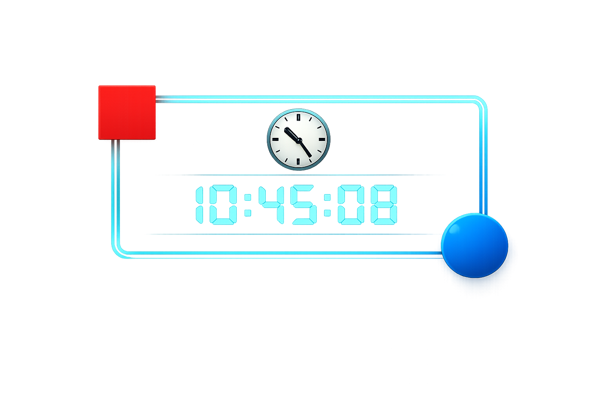

# Digital Clock



A simple and attractive Digital Clock built using HTML, CSS, and JavaScript.

## 📌 Project Description

This project displays the current time in **HH:MM:SS** format and updates automatically every second using JavaScript.

The design includes:

- 🌈 Gradient background
- 🕒 Clock icon
- 🔴 Red square decoration in the top-left corner
- 🔵 Blue circle decoration in the bottom-right corner
- ✨ Modern glassmorphism effect

## 🚀 Features

- Real-time digital clock
- Updates every second
- Responsive design
- Separate HTML, CSS, and JavaScript files
- Attractive modern UI

## 🛠️ Technologies Used

- HTML5
- CSS3
- JavaScript

## 📁 Project Structure

```text
DigitalClock/
├── index.html
├── style.css
├── script.js
├── Digital clock image.png
└── README.md
